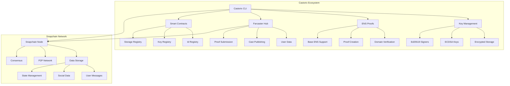

# 🔐 Castorix - Comprehensive Farcaster Protocol Integration Suite

[](https://opensource.org/licenses/GPL-2.0)
[](https://www.rust-lang.org)
[](https://farcaster.xyz)
[](https://github.com/farcasterxyz/snapchain)

A comprehensive Rust ecosystem for interacting with the Farcaster protocol, featuring secure encrypted key management, ENS domain proof creation, Farcaster Hub integration, and Snapchain data layer support.

## 🌟 Overview

Castorix is a complete toolkit for Farcaster protocol interaction, consisting of three main components:

1. **🔐 Castorix Core** - CLI tool and library for Farcaster operations
2. **📡 Snapchain** - Decentralized data storage layer implementation  
3. **🏗️ Smart Contracts** - Farcaster protocol smart contracts

## 🚀 Quick Start

### Prerequisites

- Rust 1.70+ installed
- An Ethereum RPC URL (for mainnet operations)
- A Farcaster Hub URL (or use the public API)
- Docker (for Snapchain node)

### Installation

```bash
# Clone the repository
git clone https://github.com/RyanKung/castorix.git
cd castorix

# Build the project
cargo build --release

# Install globally (optional)
cargo install --path .
```

### Basic Usage

```bash
# Generate a new encrypted wallet
castorix key generate-encrypted my-wallet "My Main Wallet"

# Create an ENS domain proof
castorix ens create vitalik.eth 12345 --wallet-name my-wallet

# Submit the proof to Farcaster Hub
castorix hub submit-proof proof.json 12345

# Run a comprehensive demo
castorix demo
```

## 🏗️ Architecture



## 🔧 Core Components

### 1. Castorix CLI & Library

A comprehensive command-line tool and Rust library for Farcaster protocol interaction.

#### Key Features

- **🔒 Secure Key Management**
  - Encrypted private key storage with Argon2 encryption
  - Multiple wallet support with friendly aliases
  - Key import/export and recovery phrase support
  - Support for both ECDSA and Ed25519 keys

- **🌐 ENS Domain Integration**
  - Domain proof creation linking ENS domains to Farcaster IDs
  - Domain verification and ownership checking
  - Base ENS subdomain support (*.base.eth)
  - Reverse lookup for all domains owned by an address

- **📡 Farcaster Hub Integration**
  - Proof submission to Farcaster Hub
  - User data retrieval and signer management
  - Cast publishing and real-time sync monitoring
  - EIP-712 signature support

- **🔑 Account Management**
  - FID registration and management
  - Signer key registration (Ed25519)
  - Custody key management (ECDSA)
  - Storage unit rental and management

### 2. Snapchain Data Layer

A high-performance, decentralized data storage layer for Farcaster social data.

#### Key Features

- **High Throughput**: Processes 10,000+ transactions per second
- **Data Availability**: Real-time access to user data for <$1,000/month
- **Canonical Implementation**: Reference implementation for Farcaster protocol
- **P2P Network**: Decentralized peer-to-peer data synchronization

#### System Requirements

- 16 GB RAM
- 4 CPU cores or vCPUs
- 1TB free storage
- Public IP address
- Ports 3381-3383 (TCP/UDP)

### 3. Smart Contracts

Complete implementation of Farcaster protocol smart contracts.

#### Contract Overview

| Contract | Purpose | Network |
|----------|---------|---------|
| **Id Registry** | Tracks Farcaster identity ownership | OP Mainnet |
| **Storage Registry** | Allocates storage and collects rent | OP Mainnet |
| **Key Registry** | Manages FID-key associations | OP Mainnet |
| **Id Gateway** | Issues new Farcaster identities | OP Mainnet |
| **Key Gateway** | Adds new key associations | OP Mainnet |
| **Bundler** | Single-transaction operations | OP Mainnet |
| **Tier Registry** | Pro subscription payments | Base Mainnet |
| **Fname Resolver** | ENS name validation | ETH Mainnet |

## 📖 Command Reference

### 🔑 Key Management

```bash
# Generate a new encrypted key
castorix key generate-encrypted [key-name] [alias]

# Import an existing private key
castorix key import [key-name] [alias] [private-key]

# List all encrypted keys
castorix key list

# Load and use a specific key
castorix key load [key-name]

# Delete a key
castorix key delete [key-name]

# Rename a key
castorix key rename [old-name] [new-name]

# Update key alias
castorix key update-alias [key-name] [new-alias]
```

### 🌐 ENS Operations

```bash
# Resolve ENS domain to address
castorix ens resolve vitalik.eth

# Get all domains owned by an address
castorix ens domains 0x1234...

# Check Base subdomain ownership
castorix ens check-base-subdomain ryankung.base.eth

# Verify domain ownership
castorix ens verify mydomain.eth

# Create username proof
castorix ens create mydomain.eth 12345 --wallet-name my-wallet

# Verify a proof
castorix ens verify-proof proof.json
```

### 📡 Hub Operations

```bash
# Get user information
castorix hub user 12345

# Submit username proof
castorix hub submit-proof proof.json 12345

# Submit proof with EIP-712 signature
castorix hub submit-proof-eip712 proof.json --wallet-name my-wallet

# Get ENS domains for a FID
castorix hub ens-domains 12345

# Get custody address
castorix hub custody-address 12345

# Get Hub sync status
castorix hub info

# Post a cast
castorix hub cast "Hello Farcaster!" 12345
```

### 🔑 Signer Management

```bash
# List all signers
castorix signers list

# Get signers for a FID
castorix signers info 12345

# Register a new signer
castorix signers register 12345 --wallet my-wallet

# Unregister a signer
castorix signers unregister 12345 --wallet my-wallet

# Export a signer key
castorix signers export [public-key-or-index]

# Delete a signer
castorix signers delete [public-key-or-index]
```

### 🔐 Custody Key Management

```bash
# List custody keys
castorix custody list

# Import custody key
castorix custody import 12345

# Generate from mnemonic
castorix custody from-mnemonic 12345

# Delete custody key
castorix custody delete 12345
```

## 🏗️ Development

### Project Structure

```
castorix/
├── src/                          # Castorix Core
│   ├── cli/                      # CLI command definitions
│   │   ├── commands.rs           # Main command structure
│   │   ├── types.rs             # Command type definitions
│   │   └── handlers/            # Command handlers
│   ├── farcaster/               # Farcaster protocol implementation
│   │   ├── contracts/           # Smart contract interactions
│   │   ├── key_manager.rs       # Key management utilities
│   │   └── message/             # Message handling
│   ├── ens_proof/               # ENS proof creation and verification
│   └── main.rs                  # Application entry point
├── examples/                    # Example code and demos
├── tests/                       # Integration tests
├── contracts/                   # Solidity contracts
│   ├── src/                     # Contract source code
│   ├── test/                    # Contract tests
│   └── script/                  # Deployment scripts
└── snapchain/                   # Snapchain data layer
    ├── src/                     # Snapchain implementation
    ├── site/                    # Documentation site
    └── docker-compose.yml       # Node deployment
```

### Available Cargo Commands

#### Test Commands
- `cargo test-local` - Run local transaction tests
- `cargo test-simple` - Run simple tests
- `cargo test-integration` - Run integration tests
- `cargo test-network` - Run network tests
- `cargo test-write-read` - Run read/write tests

#### Build Commands
- `cargo build-all` - Build project
- `cargo build-release` - Build release version
- `cargo check-all` - Check code
- `cargo check-tests` - Check tests

#### Development Commands
- `cargo dev-test` - Development testing
- `cargo dev-check` - Development checking
- `cargo dev-build` - Development building

#### Clean Commands
- `cargo clean-all` - Clean build files

### Running Tests

```bash
# Start local Anvil node
anvil --host 127.0.0.1 --port 8545 --accounts 10 --balance 10000 --gas-limit 30000000 --gas-price 1000000000 --chain-id 31337

# Run local transaction tests
cargo test-local

# Run all tests
cargo test
```

### Example Usage

```rust
use castorix::farcaster::contracts::FarcasterContractClient;
use castorix::farcaster::contracts::types::*;

#[tokio::main]
async fn main() -> Result<()> {
    // Create a client
    let client = FarcasterContractClient::new_with_default_addresses(
        "http://127.0.0.1:8545".to_string()
    )?;
    
    // Check network status
    let status = client.get_network_status().await?;
    println!("Network status: {:?}", status);
    
    Ok(())
}
```

## 🔧 Configuration

### Environment Variables

Castorix supports configuration through environment variables:

```bash
# Ethereum RPC URL
ETH_RPC_URL="https://eth-mainnet.g.alchemy.com/v2/your_api_key"

# Farcaster Hub URL
FARCASTER_HUB_URL="https://hub-api.neynar.com"

# Snapchain configuration
SNAPCHAIN_BASE_ONCHAIN_EVENTS__RPC_URL="https://base-mainnet.g.alchemy.com/v2/your_api_key"
SNAPCHAIN_L1_RPC_URL="https://eth-mainnet.g.alchemy.com/v2/your_api_key"
SNAPCHAIN_FC_NETWORK="Mainnet"
```

### Configuration Files

Create a `.env` file in your project root:

```env
# Ethereum Configuration
ETH_RPC_URL=https://eth-mainnet.g.alchemy.com/v2/your_api_key
BASE_RPC_URL=https://base-mainnet.g.alchemy.com/v2/your_api_key

# Farcaster Configuration
FARCASTER_HUB_URL=https://hub-api.neynar.com

# Snapchain Configuration
SNAPCHAIN_BASE_ONCHAIN_EVENTS__RPC_URL=https://base-mainnet.g.alchemy.com/v2/your_api_key
SNAPCHAIN_L1_RPC_URL=https://eth-mainnet.g.alchemy.com/v2/your_api_key
SNAPCHAIN_FC_NETWORK=Mainnet
SNAPCHAIN_BASE_ONCHAIN_EVENTS__START_BLOCK_NUMBER=31180908
```

## 🚀 Snapchain Node Setup

### Quick Start

```bash
# Start a new Snapchain node
curl -sSL https://raw.githubusercontent.com/farcasterxyz/snapchain/refs/heads/main/scripts/snapchain-bootstrap.sh | bash

# Check node status
curl http://localhost:3381/v1/info
```

### Manual Setup

```bash
cd snapchain

# Build Snapchain
cargo build --release

# Run development nodes
make dev

# Check node logs
docker compose logs -f node1
```

### Node Management

```bash
# Start node
./snapchain.sh start

# Stop node
./snapchain.sh stop

# Check status
./snapchain.sh status

# View logs
./snapchain.sh logs

# Upgrade node
./snapchain.sh upgrade
```

## 🛡️ Security

### Key Storage
- All private keys are encrypted using Argon2
- Keys are stored in the user's home directory
- Passwords are never stored or logged
- Support for hardware wallet integration (coming soon)

### Best Practices
- Always use encrypted key storage for production
- Keep your recovery phrases secure and offline
- Regularly backup your encrypted keys
- Use strong, unique passwords for key encryption

## 🤝 Contributing

We welcome contributions! Please see the [Contributing Guide](contracts/CONTRIBUTING.md) for details.

### Development Setup

```bash
# Fork and clone the repository
git clone https://github.com/RyanKung/castorix.git
cd castorix

# Install dependencies
cargo build

# Run tests
cargo test

# Run examples
cargo run --example complete_farcaster_test
```

## 📚 Documentation

- [API Documentation](https://docs.rs/castorix) (when published)
- [Farcaster Protocol](https://docs.farcaster.xyz)
- [ENS Documentation](https://docs.ens.domains)
- [Snapchain Whitepaper](https://github.com/farcasterxyz/protocol/discussions/207)

## 🐛 Troubleshooting

### Common Issues

1. **"No client configured for chain: BaseMainnet"**
   - Ensure you have set the `SNAPCHAIN_BASE_ONCHAIN_EVENTS__RPC_URL` environment variable
   - Check that your Base RPC URL is valid and accessible

2. **"Failed to submit message"**
   - Verify your Farcaster Hub URL is correct
   - Check that you have the necessary permissions for the FID
   - Ensure your signer key is properly registered

3. **"Insufficient balance"**
   - Check your wallet balance
   - Ensure you have enough ETH for gas fees
   - Verify the RPC URL is pointing to the correct network

4. **Snapchain node sync issues**
   - Check that ports 3381-3383 are open
   - Verify your node has sufficient resources (16GB RAM, 4 CPU cores)
   - Check node logs for specific error messages

### Getting Help

- Check the [Issues](https://github.com/RyanKung/castorix/issues) page
- Check the documentation in the `docs/` directory

## 📄 License

This project is licensed under the GPL-2.0 License - see the [LICENSE](LICENSE) file for details.

## 🙏 Acknowledgments

- [Farcaster Protocol](https://farcaster.xyz) for the amazing social protocol
- [Ethereum Name Service](https://ens.domains) for domain resolution
- [Rust](https://rust-lang.org) for the excellent language and ecosystem
- [Ethers.rs](https://github.com/gakonst/ethers-rs) for Ethereum integration
- [Snapchain](https://github.com/farcasterxyz/snapchain) for the data layer implementation

## 📊 Test Results

```bash
$ cargo test-local
running 2 tests
test test_network_connectivity ... ok
test test_simple_local_transaction ... ok
test result: ok. 2 passed; 0 failed; 0 ignored; 0 measured; 0 filtered out
```

---

**Made with ❤️ for the Farcaster community**

*Castorix - Bridging the gap between ENS domains and Farcaster identity with security, simplicity, and scalability.*